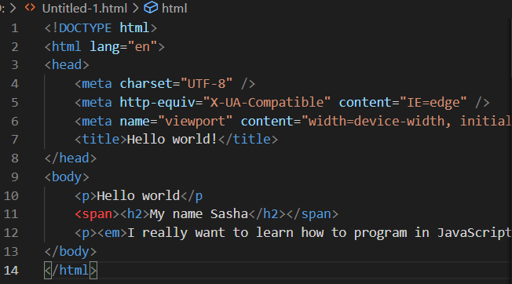

# _rsschool-cv_
***
# ***Aleksandr Hatyliuk*** 

## ***Contact information:***
 - _Phone:+375292064300_ 
 - _E-mail: saha12345678912345@gmail.com_
 - _Tellegram: @Alexandr Gatyliuk_
 - _Viber:+375292064300_
 ---
## ***Briefly About Myself:***
### _After graduating from high school, I entered the Polytechnic College, graduated with honors, entered Bstu, I study in an abbreviated form. I decided to take up JavaScript, because many of my friends advised me to start with it. Previously, he was engaged in 3D visualization and project design on various virtual machines like Solidworks, Kompas 3D, 3D Max, AutoCAD. Currently in search of his future profession._
---
## ***Skills***
- _Solidworks_
- _Kompas 3D_
- _3D Max_
- _AutoCad_
- _Layout_
---
## ***Code example:***
### _I recently started programming in JavaScript, so the banal code would be Hello world._

---
## ***Courses:***
- _RS Schools Course «JavaScript/Front-end. Stage 0» (in progress)_
___
## ***Languages:***
- _English - I read/translate_
- _Russian - spoken_
- _Belarusian is the native language_
